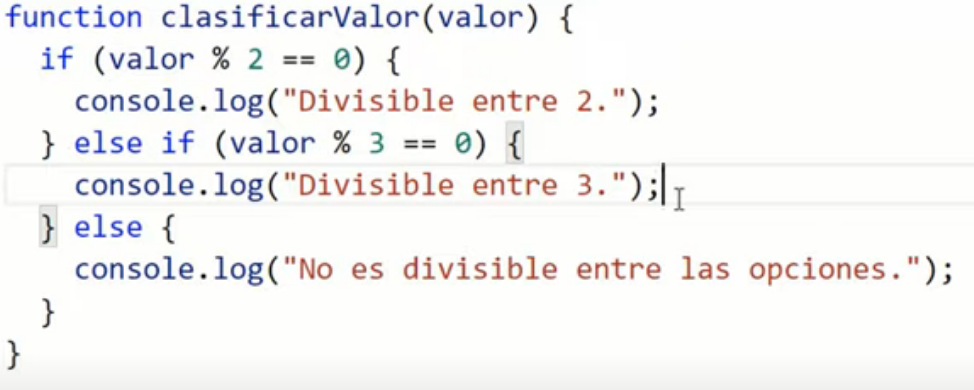
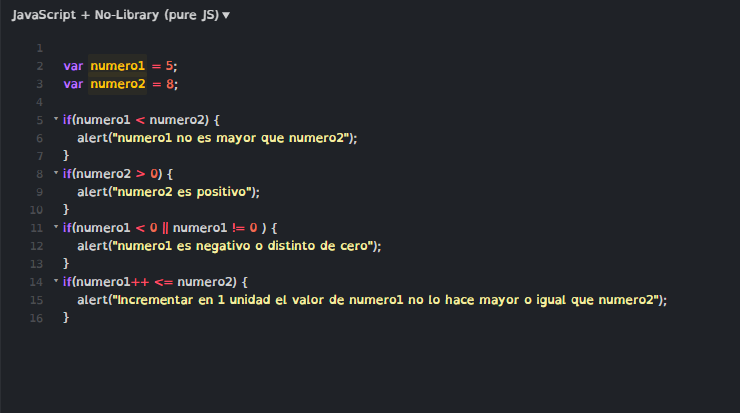
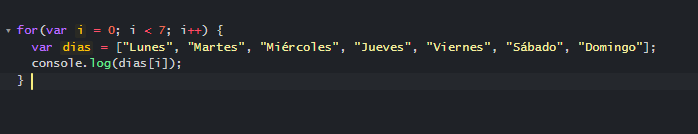
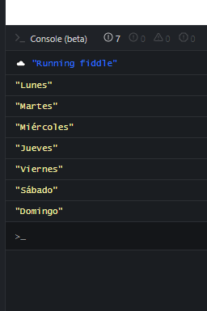
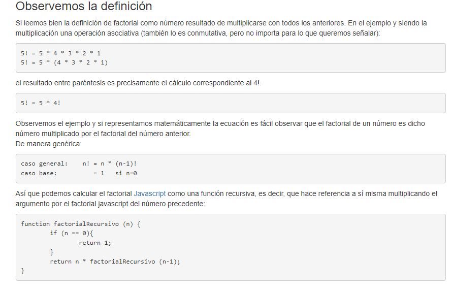

Los programas que se pueden realizar utilizando solamente variables y operadores son una simple sucesión lineal de instrucciones básicas. 

Sin embargo, no se pueden realizar programas que muestren un mensaje si el valor de una variable es igual a un valor determinado y no muestren el mensaje en el resto de casos. Tampoco se puede repetir de forma eficiente una misma instrucción, como por ejemplo sumar un determinado valor a todos los elementos de un array. 

Para realizar este tipo de programas son necesarias las estructuras de control de flujo, que son instrucciones del tipo "si se cumple esta condición, hazlo; si no se cumple, haz esto otro". También existen instrucciones del tipo "repite esto mientras se cumpla esta condición". 

Si se utilizan estructuras de control de flujo, los programas dejan de ser una sucesión lineal de instrucciones para convertirse en programas inteligentes que pueden tomar decisiones en función del valor de las variables. 

Las estructuras condicionada no ejecutan ninguna línea de código si es una estructuras "if" y la condición no se cumple, no obstante si es una estructura más elaborada siempre se ejecutara como máximo una sola línea de código de todas las posibles opciones. Ejemplo

Si no se cumple 'if', se pasa a 'else if', luego, si no se cumple 'else if' se pasa a 'else'. 

3.4.1. Estructura if (también se conocen como estructuras condicionales) 

La estructura más utilizada en JavaScript y en la mayoría de lenguajes de programación es la estructura if. Se emplea para tomar decisiones en función de una condición. Su definición formal es: 

if(condicion) { 
  ... 
} 

Si la condición se cumple (es decir, si su valor es true) se ejecutan todas las instrucciones que se encuentran dentro de {...}. Si la condición no se cumple (es decir, si su valor es false) no se ejecuta ninguna instrucción contenida en {...} y el programa continúa ejecutando el resto de instrucciones del script. 

Ejemplo: 

var mostrarMensaje = true; 

if(mostrarMensaje) { 
  alert("Hola Mundo"); 
} 

En el ejemplo anterior, el mensaje sí que se muestra al usuario ya que la variable mostrarMensaje tiene un valor de true y por tanto, el programa entra dentro del bloque de instrucciones del if. 

El ejemplo se podría reescribir también como: 

var mostrarMensaje = true; 

if(mostrarMensaje == true) { 
  alert("Hola Mundo"); 
} 

En este caso, la condición es una comparación entre el valor de la variable mostrarMensaje y el valor true. Como los dos valores coinciden, la igualdad se cumple y por tanto la condición es cierta, su valor es true y se ejecutan las instrucciones contenidas en ese bloque del if. 

La comparación del ejemplo anterior suele ser el origen de muchos errores de programación, al confundir los operadores == y =. Las comparaciones siempre se realizan con el operador ==, ya que el operador = solamente asigna valores: 

var mostrarMensaje = true; 

// Se comparan los dos valores 
if(mostrarMensaje == false) { 
  ... 
} 

// Error - Se asigna el valor "false" a la variable 
if(mostrarMensaje = false) { 
  ... 
} 

La condición que controla el if() puede combinar los diferentes operadores lógicos y relacionales mostrados anteriormente: 

var mostrado = false; 

if(!mostrado) { 
  alert("Es la primera vez que se muestra el mensaje"); 
} 

Los operadores AND y OR permiten encadenar varias condiciones simples para construir condiciones complejas: 

var mostrado = false; 
var usuarioPermiteMensajes = true; 

if(!mostrado && usuarioPermiteMensajes) { 
  alert("Es la primera vez que se muestra el mensaje"); 
} 

La condición anterior está formada por una operación AND sobre dos variables. A su vez, a la primera variable se le aplica el operador de negación antes de realizar la operación AND. De esta forma, como el valor de mostrado es false, el valor !mostrado sería true. Como la 

 variable usuarioPermiteMensajes vale true, el resultado de !mostrado && usuarioPermiteMensajes sería igual a true && true, por lo que el resultado final de la condición del if() sería true y por tanto, se ejecutan las instrucciones que se encuentran dentro del bloque del if(). 

Ejercicio 5 

Completar las condiciones de los if del siguiente script para que los mensajes de los alert() se muestren siempre de forma correcta: 

var numero1 = 5; 

var numero2 = 8; 

if(...) { 
  alert("numero1 no es mayor que numero2"); 
} 

if(...) { 
  alert("numero2 es positivo"); 
} 

if(...) { 
  alert("numero1 es negativo o distinto de cero"); 
} 

if(...) { 
  alert("Incrementar en 1 unidad el valor de numero1 no lo hace mayor o igual que numero2"); 
} 

Ver solución 

3.4.2. Estructura if...else (también se conocen como estructuras condicionales) 

En ocasiones, las decisiones que se deben realizar no son del tipo "si se cumple la condición, hazlo; si no se cumple, no hagas nada". Normalmente las condiciones suelen ser del tipo "si se cumple esta condición, hazlo; si no se cumple, haz esto otro". 

Para este segundo tipo de decisiones, existe una variante de la estructura if llamada if...else. Su definición formal es la siguiente: 

if(condicion) { 
  ... 
} 
else { 
  ... 
} 

Si la condición se cumple (es decir, si su valor es true) se ejecutan todas las instrucciones que se encuentran dentro del if(). Si la condición no se cumple (es decir, si su valor es false) se ejecutan todas las instrucciones contenidas en else { }. Ejemplo: 

var edad = 18; 

if(edad >= 18) { 
  alert("Eres mayor de edad"); 
} 
else { 
  alert("Todavía eres menor de edad"); 
} 

Si el valor de la variable edad es mayor o igual que el valor numérico 18, la condición del if() se cumple y por tanto, se ejecutan sus instrucciones y se muestra el mensaje "Eres mayor de edad". Sin embargo, cuando el valor de la variable edad no es igual o mayor que 18, la condición del if() no se cumple, por lo que automáticamente se ejecutan todas las instrucciones del bloque else { }. En este caso, se mostraría el mensaje "Todavía eres menor de edad". 

El siguiente ejemplo compara variables de tipo cadena de texto: 

var nombre = ""; 

if(nombre == "") { 
  alert("Aún no nos has dicho tu nombre"); 
} 
else { 
  alert("Hemos guardado tu nombre"); 
} 

La condición del if() anterior se construye mediante el operador ==, que es el que se emplea para comparar dos valores (no confundir con el operador = que se utiliza para asignar valores). En el ejemplo anterior, si la cadena de texto almacenada en la variable nombre es vacía (es decir, es igual a "") se muestra el mensaje definido en el if(). En otro caso, se muestra el mensaje definido en el bloque else { }. 

La estructura if...else se puede encadenar para realizar varias comprobaciones seguidas: 

if(edad < 12) { 
  alert("Todavía eres muy pequeño"); 
} 
else if(edad < 19) { 
  alert("Eres un adolescente"); 
} 
else if(edad < 35) { 
  alert("Aun sigues siendo joven"); 
} 
else { 
  alert("Piensa en cuidarte un poco más"); 
} 

No es obligatorio que la combinación de estructuras if...else acabe con la instrucción else, ya que puede terminar con una instrucción de tipo else if(). 

Ejercicio 6 

El cálculo de la letra del Documento Nacional de Identidad (DNI) es un proceso matemático sencillo que se basa en obtener el resto de la división entera del número de DNI y el número 23. A partir del resto de la división, se obtiene la letra seleccionándola dentro de un array de letras. 

El array de letras es: 

var letras = ['T', 'R', 'W', 'A', 'G', 'M', 'Y', 'F', 'P', 'D', 'X', 'B', 'N', 'J', 'Z', 'S', 'Q', 'V', 'H', 'L', 'C', 'K', 'E', 'T']; 

Por tanto si el resto de la división es 0, la letra del DNI es la T y si el resto es 3 la letra es la A. Con estos datos, elaborar un pequeño script que: 

Almacene en una variable el número de DNI indicado por el usuario y en otra variable la letra del DNI que se ha indicado. (Pista: si se quiere pedir directamente al usuario que indique su número y su letra, se puede utilizar la función prompt()) 

En primer lugar (y en una sola instrucción) se debe comprobar si el número es menor que 0 o mayor que 99999999. Si ese es el caso, se muestra un mensaje al usuario indicando que el número proporcionado no es válido y el programa no muestra más mensajes. 

Si el número es válido, se calcula la letra que le corresponde según el método explicado anteriormente. 

Una vez calculada la letra, se debe comparar con la letra indicada por el usuario. Si no coinciden, se muestra un mensaje al usuario diciéndole que la letra que ha indicado no es correcta. En otro caso, se muestra un mensaje indicando que el número y la letra de DNI son correctos. 

Ver solución 

Operador condicional (ternario) 

El operador condicional (ternario) es el único operador en JavaScript que tiene tres operandos. Este operador se usa con frecuencia como atajo para la instrucción if. 

Sintaxis 

condición ? expr1 : expr2 

Parámetros 

condición 

Una expresión que se evalúa como true o false. 

expr1, expr2 

Expresión con valores de algún tipo. 

Descripción 

Si la condición es true, el operador retorna el valor de la expr1; de lo contrario, devuelve el valor de expr2. 

example: 

// retornar el mínimo valor 

function retornarElMinValor(x, y){ 

if(x < y){ 

return console.log(x); 

} else {console.log(y);} 

} 

function retornarElMinValor2(x, y){ 

console.log(x < y ? x : y); 

} 

retornarElMinValor(1, 2); // 1 

retornarElMinValor2(1, 2); //1 

3.4.3. Estructura for (también se conocen como estructuras condicionales) 

En este caso la traducción de for seria 'para', entonces: para(estas condiciones que se van modificando){hacer esto si se cumplen las condiciones}. 

Las estructuras if y if...else no son muy eficientes cuando se desea ejecutar de forma repetitiva una instrucción. Por ejemplo, si se quiere mostrar un mensaje cinco veces, se podría pensar en utilizar el siguiente if: 

var veces = 0; 

if(veces < 4) { 
  alert("Mensaje"); 
  veces++; 
} 

Se comprueba si la variable veces es menor que 4. Si se cumple, se entra dentro del if(), se muestra el mensaje y se incrementa el valor de la variable veces. Así se debería seguir ejecutando hasta mostrar el mensaje las cinco veces deseadas. Sin embargo, el funcionamiento real del script anterior es muy diferente al deseado, ya que solamente se muestra una vez el mensaje por pantalla. La razón es que la ejecución de la estructura if() no se repite y la comprobación de la condición sólo se realiza una vez, independientemente de que dentro del if() se modifique el valor de la variable utilizada en la condición. 

La estructura for permite realizar este tipo de repeticiones (también llamadas bucles) de una forma muy sencilla. No obstante, su definición formal no es tan sencilla como la de if(): 

for(inicializacion; condicion; actualizacion) { 
  ... 
} 

La idea del funcionamiento de un bucle for es la siguiente: "mientras la condición indicada se siga cumpliendo, repite la ejecución de las instrucciones definidas dentro del for. Además, después de cada repetición, actualiza el valor de las variables que se utilizan en la condición". 

La "inicialización" es la zona en la que se establece los valores iniciales de las variables que controlan la repetición. 

La "condición" es el único elemento que decide si continua o se detiene la repetición. 

La "actualización" es el nuevo valor que se asigna después de cada repetición a las variables que controlan la repetición. 

var mensaje = "Hola, estoy dentro de un bucle"; 

for (var i = 0; i < 5; i++) { 
  alert(mensaje); 
} 

La parte de la inicialización del bucle consiste en: 

var i = 0; 

Por tanto, en primer lugar se crea la variable "i" y se le asigna el valor de 0. Esta zona de inicialización solamente se tiene en consideración justo antes de comenzar a ejecutar el bucle. Las siguientes repeticiones no tienen en cuenta esta parte de inicialización. 

La zona de condición del bucle es: 

i < 5 

Los bucles se siguen ejecutando mientras se cumplan las condiciones y se dejan de ejecutar justo después de comprobar que la condición no se cumple. En este caso, mientras la variable i valga menos de 5 el bucle se ejecuta indefinidamente. 

Como la variable i se ha inicializado a un valor de 0 y la condición para salir del bucle es que i sea menor que 5, si no se modifica el valor de i de alguna forma, el bucle se repetiría indefinidamente. 

Por ese motivo, es imprescindible indicar la zona de actualización, en la que se modifica el valor de las variables que controlan el bucle: 

i++ 

En este caso, el valor de la variable i se incrementa en una unidad después de cada repetición. La zona de actualización se ejecuta después de la ejecución de las instrucciones que incluye el for. 

Así, durante la ejecución de la quinta repetición el valor de i será 4. Después de la quinta ejecución, se actualiza el valor de i, que ahora valdrá 5. Como la condición es que i sea menor que 5, la condición ya no se cumple y las instrucciones del for no se ejecutan una sexta vez. 

Normalmente, la variable que controla los bucles for se llama i, ya que recuerda a la palabra índice y su nombre tan corto ahorra mucho tiempo y espacio. 

El ejemplo anterior que mostraba los días de la semana contenidos en un array se puede rehacer de forma más sencilla utilizando la estructura for: 

var dias = ["Lunes", "Martes", "Miércoles", "Jueves", "Viernes", "Sábado", "Domingo"]; 

for (var i=0; i<7; i++) { 
  alert(dias[i]); 
} 

Ejercicio 7 

El factorial de un número entero n es una operación matemática que consiste en multiplicar todos los factores n x (n-1) x (n-2) x ... x 1. Así, el factorial de 5 (escrito como 5!) es igual a: 5! = 5 x 4 x 3 x 2 x 1 = 120 

Utilizando la estructura for, crear un script que calcule el factorial de un número entero. 

Ver solución 

function factorial (n) { 

    var total = 1;  
    for (i=1; i<=n; i++) { 
    total = total * i;  

  } 
  return total;  
} 

Si n =3  

# i=1; 1<=3 – ok; i=2

# var x = 1

# x = 1 * 1

https://lineadecodigo.com/javascript/factorial-javascript/ 

var numero = prompt("Introduce un número y se mostrará su factorial"); esta funcionalidad es para solicitar un número en pantalla y que este sea almacenado en la variable indicada 

var resultado = 1; 

for(var i=1; i<=numero; i++) { 

  resultado *= i; 

} 

Lo que ocurre con este bucle es que se repite pero no manda ningún mensaje en pantalla... lo que va haciendo es cambiar el valor de la variable 'resultado' que partió en '1'. En cada pasada la variable 'resultado' se va multiplicando por el valor de 'i' que en cada pasada va aumentando en 1, Como esto se repite una cantidad de veces equivalente al número indicado lo que ocurre matemáticamente es lo siguiente 

1*1 = 1 

1*2=2 

2*3=6 

6*4=24   y así hasta la cantidad de veces equivalente al número indicado. Luego, el variable posee el valor requerido y el bucle ha finalizado, por lo cual, solo restaría presentar el valor de la variable en pantalla. 

console.log(resultado); 

alert(resultado); está funcionalidad envía un mensaje en pantalla. 

Como se muestra en la otra imagen, otra forma de lograr lo mismo es con una función que incorpore una condicional: la función tiene por objetivo retornar 1 para la variable 0 y f 

4.4.3. Estructura switch 

La estructura if...else se puede utilizar para realizar comprobaciones múltiples y tomar decisiones complejas. Sin embargo, si todas las condiciones dependen siempre de la misma variable, el código JavaScript resultante es demasiado redundante: 

if(numero == 5) { 

  ... 

} 

else if(numero == 8) { 

  ... 

} 

else if(numero == 20) { 

  ... 

} 

else { 

  ... 

} 

En estos casos, la estructura switch es la más eficiente, ya que está especialmente diseñada para manejar de forma sencilla múltiples condiciones sobre la misma variable. Su definición formal puede parecer compleja, aunque su uso es muy sencillo: 

switch(variable) { 

  case valor_1: 

    ... 
    
    break; 

  case valor_2: 

    ... 
    
    break; 

  ... 

  case valor_n: 

    ... 
    
    break; 

  default: 

    ... 
    
    break; 

} 

El anterior ejemplo realizado con if...else se puede rehacer mediante switch: 

switch(numero) { 

  case 5: 

    ... 
    
    break; 

  case 8: 

    ... 
    
    break; 

  case 20: 

    ... 
    
    break; 

  default: 

    ... 
    
    break; 

} 

La estructura switch se define mediante la palabra reservada switch seguida, entre paréntesis, del nombre de la variable que se va a utilizar en las comparaciones. Como es habitual, las instrucciones que forman parte del switch se encierran entre las llaves { y }. 

Dentro del switch se definen todas las comparaciones que se quieren realizar sobre el valor de la variable. Cada comparación se indica mediante la palabra reservada case seguida del valor con el que se realiza la comparación. Si el valor de la variable utilizada por switch coincide con el valor indicado por case, se ejecutan las instrucciones definidas dentro de ese case. 

Normalmente, después de las instrucciones de cada case se incluye la sentencia break para terminar la ejecución del switch, aunque no es obligatorio. Las comparaciones se realizan por orden, desde el primer case hasta el último, por lo que es muy importante el orden en el que se definen los case. 

¿Qué sucede si ningún valor de la variable del switch coincide con los valores definidos en los case? En este caso, se utiliza el valor default para indicar las instrucciones que se ejecutan en el caso en el que ningún case se cumpla para la variable indicada. 

Aunque default es opcional, las estructuras switch suelen incluirlo para definir al menos un valor por defecto para alguna variable o para mostrar algún mensaje por pantalla. 

---

3.4.4. Estructura for...in (también se conocen como estructuras condicionales) 

Una estructura de control derivada de for es la estructura for...in. Su definición exacta implica el uso de objetos. 

En array 

for (indice in array) { 
  ... 
} 

Para Objetos 

for (key in objeto) { 
  ... 
} 

Si se quieren recorrer todos los elementos que forman un array, la estructura for...in es la forma más eficiente de hacerlo, como se muestra en el siguiente ejemplo: 

var dias = ["Lunes", "Martes", "Miércoles", "Jueves", "Viernes", "Sábado", "Domingo"]; 

for(i in dias) { 
  alert(dias[i]); 
} 

La variable que se indica como indice es la que se puede utilizar dentro del bucle for...in para acceder a los elementos del array. De esta forma, en la primera repetición del bucle la variable i vale 0 y en la última vale 6. 

Esta estructura de control es la más adecuada para recorrer arrays (y objetos), ya que evita tener que indicar la inicialización y las condiciones del bucle for simple y funciona correctamente cualquiera que sea la longitud del array. De hecho, sigue funcionando igual aunque varíe el número de elementos del array. 

/* 

por lo visto se repite hasta terminar el array: 

resultado del código anterior con console.log() 

*/ 

agregar un ejemplo para un objeto 

4.4. Otras estructuras de control 

Las estructuras de control de flujo que se han visto (if, else, for) y las sentencias que modifican su comportamiento (break, continue) no son suficientes para realizar algunas tareas complejas y otro tipo de repeticiones. Por ese motivo, JavaScript proporciona otras estructuras de control de flujo diferentes y en algunos casos más eficientes. 

4.4.1. Estructura while 

La estructura while permite crear bucles que se ejecutan ninguna o más veces, dependiendo de la condición indicada. Su definición formal es: 

while(condicion) { 

  ... 

} 

El funcionamiento del bucle while se resume en: "mientras se cumpla la condición indicada, repite indefinidamente las instrucciones incluidas dentro del bucle". 

Si la condición no se cumple ni siquiera la primera vez, el bucle no se ejecuta. Si la condición se cumple, se ejecutan las instrucciones una vez y se vuelve a comprobar la condición. Si se sigue cumpliendo la condición, se vuelve a ejecutar el bucle y así se continúa hasta que la condición no se cumpla. 

Evidentemente, las variables que controlan la condición deben modificarse dentro del propio bucle, ya que de otra forma, la condición se cumpliría siempre y el bucle while se repetiría indefinidamente. 

El siguiente ejemplo utiliza el bucle while para sumar todos los números menores o iguales que otro número: 

var resultado = 0; 

var numero = 100; 

var i = 0; 

while(i <= numero) { 

  resultado += i; 

  i++; 

} 

alert(resultado); 

El programa debe sumar todos los números menores o igual que otro dado. Por ejemplo si el número es 5, se debe calcular: 1 + 2 + 3 + 4 + 5 = 15 

Este tipo de condiciones "suma números mientras sean menores o iguales que otro número dado") se resuelven muy fácilmente con los bucles tipo while, aunque también se podían resolver con bucles de tipo for. 

En el ejemplo anterior, mientras se cumpla la condición, es decir, mientras que la variable i sea menor o igual que la variable numero, se ejecutan las instrucciones del bucle. 

Dentro del bucle se suma el valor de la variable i al resultado total (variable resultado) y se actualiza el valor de la variable i, que es la que controla la condición del bucle. Si no se actualiza el valor de la variable i, la ejecución del bucle continua infinitamente o hasta que el navegador permita al usuario detener el script. 

4.4.2. Estructura do...while 

El bucle de tipo do...while es muy similar al bucle while, salvo que en este caso siempre se ejecutan las instrucciones del bucle al menos la primera vez. Su definición formal es: 

do { 

  ... 

} while(condicion); 

De esta forma, como la condición se comprueba después de cada repetición, la primera vez siempre se ejecutan las instrucciones del bucle. Es importante no olvidar que después del while() se debe añadir el carácter ; (al contrario de lo que sucede con el bucle while simple). 

Utilizando este bucle se puede calcular fácilmente el factorial de un número: 

var resultado = 1; 

var numero = 5; 

do { 

  resultado *= numero;  // resultado = resultado * numero 

  numero--; 

} while(numero > 0); 

alert(resultado); 

En el código anterior, el resultado se multiplica en cada repetición por el valor de la variable numero. Además, en cada repetición se decrementa el valor de esta variable numero. La condición del bucle do...while es que el valor de numero sea mayor que 0, ya que el factorial de un número multiplica todos los números menores o iguales que él mismo, pero hasta el número 1 (el factorial de 5 por ejemplo es 5 x 4 x 3 x 2 x 1 = 120). 

Como en cada repetición se decrementa el valor de la variable numero y la condición es que numero sea mayor que cero, en la repetición en la que numero valga 0, la condición ya no se cumple y el programa se sale del bucle do...while. 